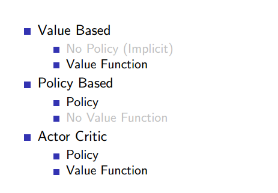
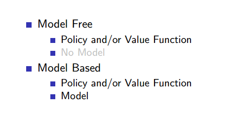
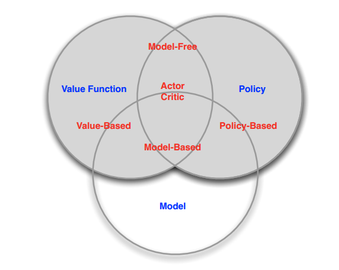

# 第一课 RL介绍

课程ppt已上传。

## RL与其他机器学习算法的不同

* 与一般监督学习不同，它没有监督标签，只有一个奖励信号
* 回馈是有延时的，不是即时的
* 序列性，因此时间很关键
* 智能体的行动会影响接下来的子序列

## 一些 强化学习的例子

这里简单说一些：
* 直升飞机进行特技表演，这是吴恩达在斯坦福做出来的东西，没有特定程式的控制，飞机自己学习特技表演，仅仅依靠奖励来提升自己
* 阿尔法狗的自对弈，就是强化学习，通过胜负这个奖励信号，不断提升自己的棋力

## 奖励

* 奖励Rt是一个标量的回馈信号
* 表明了智能体在这个时间步t的表现如何
* 智能体的目的就是最大化这个累计奖励，累计奖励也就是接下来会说到的回报

```
奖励假设：
所有的目标可以由最大化期望累计奖励来描述
```

## 智能体和环境


如图：
* 在每一步t，智能体执行动作At，获得一个来自环境的观察和一个标量奖励Rt
* 环境获取智能体的动作At，发出t+1时刻的环境观察Ot+1和t+1时刻的标量奖励Rt+1
* t在每一次环境更新的时候增加，因为状态进入了下一步

## 历史和状态

历史history是一个序列的观察，动作和奖励;
```
Ht = O1; R1; A1; ...; At−1; Ot; R
```
下一步发生什么取决于历史，包括：
* 智能体选择的动作
* 环境选择的观察和奖励

状态（State）是用来决定下一步发生什么的信息，它是history的函数：
```
St = f (Ht)
```

### 几种State

State分为环境State，智能体State和信息State：


* 环境State
 
  * 是环境的私有表示
  
  * 是一些环境用来挑选下一步观察和奖励的数据
  
  * 环境State并不总是对智能体可见
  
  * 即使可见，也可能包含一些对任务无关的信息

* 智能体State
  
  * 它是智能体的内部表示
 
  * 包含一些智能体用来挑选下一步动作的信息
  
  * 智能体State是我们强化学习算法需要的状态
  
  * 他可以是history的任何函数：``` Sat = f (Ht)```

* 信息State
  
  * 它包含历史中所有游泳的信息
  
  * 也成为Markov State，马尔科夫状态
  
  * 既然叫马尔科夫状态，也就是说，下一个状态只依赖于当前状态
  
  * 环境State也是马尔科夫的
  
  * history也是马尔科夫的
  
  
## 环境

### 完全可观察环境

智能体直接观察到环境状态。此时```Ot=S智能体=S环境```。

* Agent state = environment state = information state
* 这是一个马尔可夫决策过程(MDP)

### 部分观察环境

智能体不能直接观察环境：
* 比如机器人的摄像头不能告诉他具体的位置
* 卡牌游戏不知道别人的牌，只知道已经打出的牌

此时agent state 不等于 environment state，所以这只是一个 partially observable Markov decision process
(POMDP)，部分可观察马尔科夫决策过程。

在这种情况下，智能体没法参考环境状态，必须构建自己的状态表示：
* 使用完整的history，```St = Ht```
* 坚信环境状态：```St智能体 =（P[St环境 = s1],....,P[St环境=Sn]）```
* 使用循环神经网络

## RL 智能体的主要构成

* Policy,agent’s behaviour function
* Value function: how good is each state and/or action
* Model: agent’s representation of the environment

### Policy

* 是智能体的行为
* 是状态到动作的映射
* 可能是确定的策略，也可能是随机的策略，随机有助于探索未知的奖励

### Value Function

* 未来奖励的预测
* 用来估计状态的好坏
* 在动作之间选择


### Model

* model预测环境接下来做什么
* P 预测下一个状态
* R预测下一个即时奖励


## 智能体分类

根据上面的智能体的构成





总结一下就是下图：




## 探索和开发

强化学习里老生常谈的问题了，注重探索有可能找到更好的方案，注重开发可以充分挖掘已经获得的知识，就是一个
权衡问题(Trade-off).


