# 第五课 免模型控制

课程ppt已上传为pdf。

## 概述

上次课主要讲解的是免模型预测，也就是说在未知的MDP中，根据策略和<S,A,R>预测价值函数。
这次课自然就要说到免模型控制了，毕竟更新策略才是强化学习的主要目的。

需要注意的是，其实免模型控制不一定非要只在不知道模型的情况下使用，即使知道模型，有些时候我们也用免模型控制，
比如模型的状态太多的情况下，举个例子，围棋，状态数有10的170次方，比宇宙间的原子总数还多，那你想想你的
状态转移矩阵和奖励得有多大，即使你完全知道模型，你也不能动态规划。

## 在策略和离策略

关于在策略和离策略，这里先有一个直观的理解，后面还会深入看的。

在策略：
* 从工作中学习
* 从经验学习策略π，而经验也是由π采样得到的

离策略：
* 站在别人的肩膀上
* 从经验学习策略π，而经验是由另一个策略u采样得到的

上面给你一个直观地理解，为了清晰一点，我再举一个例子，比如Q-learning算法，这个算法将在下面讨论，
现在先拿来举个例子，Q-learning算法是一种TD算法，更新动作状态价值Q采用的自然就是TD的方式，也就是
Q=Q+α（target-Q），这个target利用的是下一步Q值最大的那个动作来计算的，此时算法还没有真正的采取动作，
只是计算了一下上一个动作的Q值，而真正采取动作时，选择的动作不一定是刚才计算Q值的那个动作，（也就是Q值最大的那个动作）
而是继续用执行上一步动作的那个策略来选择动作，可能会选择到Q值很小的动作。也就是说计算Target的策略和真实动作采样的策略是不一样的。
这就是离策略。

而当我们下面说到Sarsa算法的时候，他就和Q learning算法不一样了，它计算Q值的时候继续使用的是上一步动作的那个策略来选择动作，也就是
计算Target的策略和真实动作采样的策略是一样的，顾名思义，在策略。

## 广义策略迭代

前面第二课策略迭代的时候，推广了一下策略迭代，可以用其他的策略估计和策略提升算法来扩展策略迭代。
如下图：

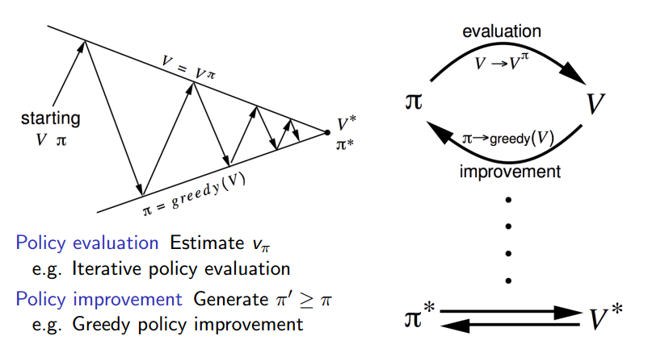

之前策略迭代中的策略评估用的是基于模型的迭代策略评估，应用的是贝尔曼期望方程。现在我们已经学习了免模型的方法，
比如MC，那么我们能不能把MC替换原来策略迭代的策略评估部分，策略提升部分继续用贪婪策略呢？就像下面一样：

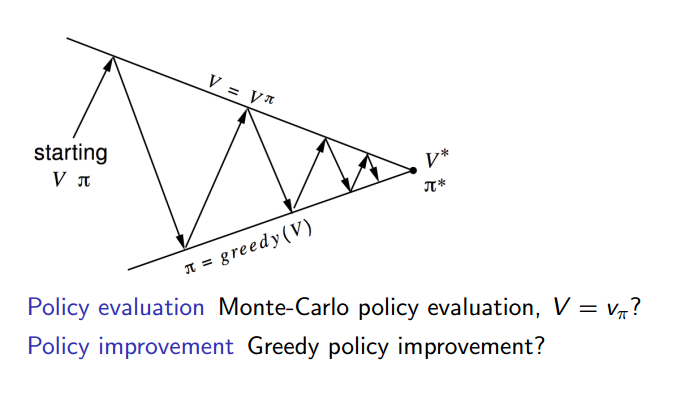

想一想，这其实有两个问题。
* 如下图，虽然策略评估部分没有用到模型的信息，P和R，但是策略提升的时候需要用到。

那么怎么解决呢？用V，也就是状态动作价值时候出现这个问题，那么用动作价值函数的时候可不可以呢？如下图：

真的可以，因此可以把V的评估换成对Q的评估，这样就完全免模型了。

* 还有一个问题呢？利用贪婪策略真的可以吗？我们之前在策略迭代部分贪婪策略被证明是一定可以优化策略的，
至少不会变得更差，那么这里为什么不可以呢？因为那时候是基于模型的，我们完全知道模型状态，我们在做动态规划。
而现在，我们是免模型的，是通过采样学习的，通过一个个的经验片段来学习，我们不能保证其他的策略的优劣，因此
必须要加入探索。可以利用epsilon-greedy来做到。

epsilon-greedy 算法很简单，epsilon是0-1之间的数，有epsilon的概率我们选择随机探索，1-epsilon的概率我们采取贪婪策略。

## 蒙特卡洛策略迭代

经过上面的修改后，改进之后的蒙特卡洛策略迭代如下图：

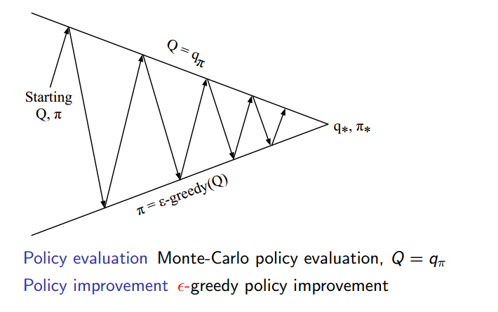

但是，实际中，我们并不需要每次都把所有的Q值评估完全，这样浪费了很大的时间和精力，实际中我们的蒙特卡洛策略迭代一般如下：

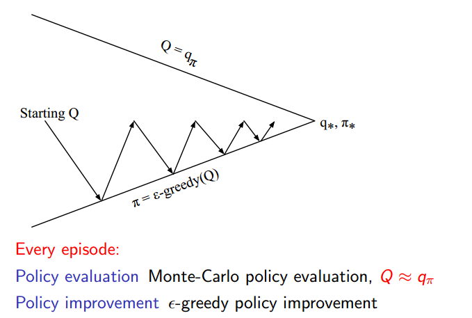

## GLIE 蒙特卡洛策略迭代

当蒙特卡洛策略迭代满足GLIE性质的时候，我们称它是GLIE 蒙特卡洛策略迭代。
* GLIE 蒙特卡洛策略迭代可以收敛到最优的Q和π

### GLIE性质

* 每个状态被访问无数次
* 策略向贪婪收敛，也就是最后变成一个固定的策略

所以只需要把蒙特卡洛策略迭代的epsilon变成与经验片段号负相关就可以了，这样随着时间的进行，epsilon趋向于0，
epsilon-greedy也就趋向于greedy。

GLIE 蒙特卡洛策略迭代的完整流程如下：(还是非常清晰的)

## Sarsa

既然MC可以当策略评估，那么TD自然也可以。Sarsa算法就是利用TD的例子，Sarsa的Q值更新如下：

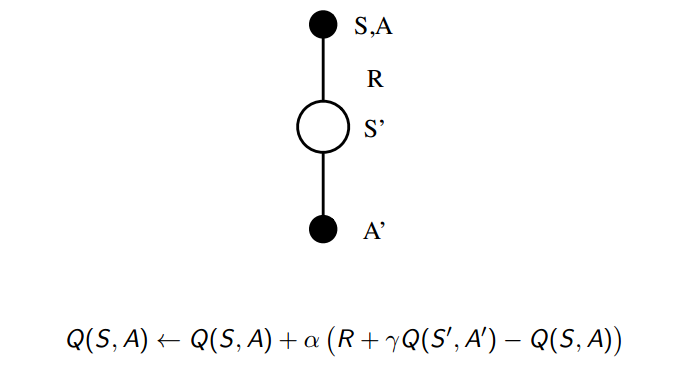

看这个图，你应该知道Sarsa名字的由来了。

前面提到Sarsa是一种在策略学习，它的算法流程如下：

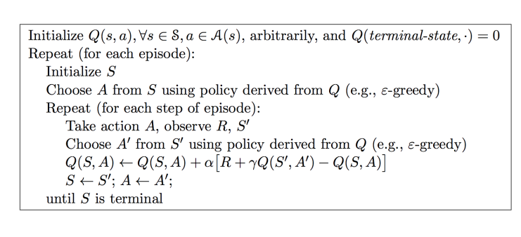

注意和MC Polocy iteration 不同的是，前者是每个episode更新一次，这个是每个time step更新一次，
所以说Sarsa是在线更新的。

### Sarsa的收敛性

Sarsa收敛到最优Q是有两个条件的，但是实际中，我们并不考虑，他总能收敛到接近最优。

## Sarsa(λ)

MC和TD都说到了，自然中间过度方法TD(λ)也要提到，应用上之后，Sarsa就变成了Sarsa(λ)。
同样有前向和后向视角。我就不多说了，前面TD(λ)的时候说的很清楚了，由于工程应用，因此我们只关注
Backward View Sarsa(λ)，更新流程如下:

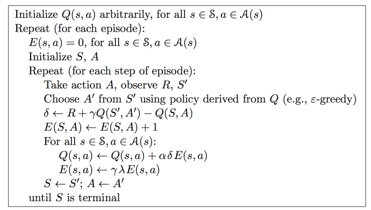

## 离策略学习

### 重要性采样

公式如下：

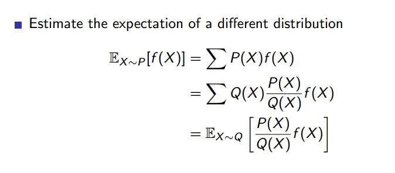

因为Q learning中不需要重要性采样，所以我就不多说了，但是这个很重要，可以多看看ppt。

### Q-learning

Q值更新如下，和Sarsa的区别开头也说了，主要在计算target的时候，因此Qlearning也叫SarsaMAX。

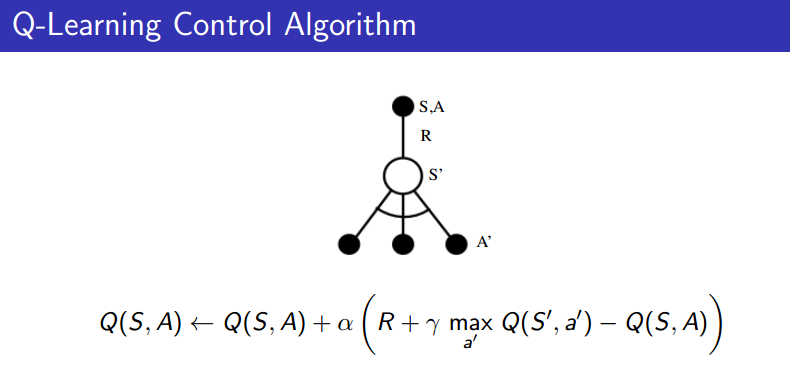

Qlearning是可以收敛到最优Q的，不像Sarsa需要一定条件。

算法细节如下，对照Sarsa，还是很容易理解的。

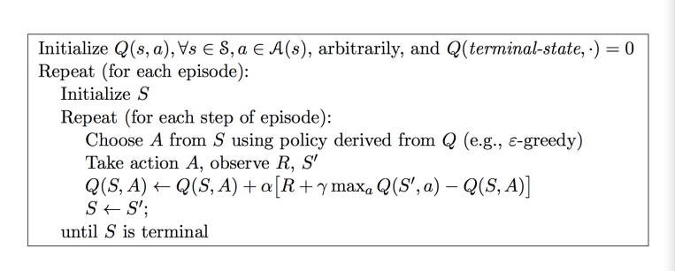

## 总结

最后给出两个总结图：

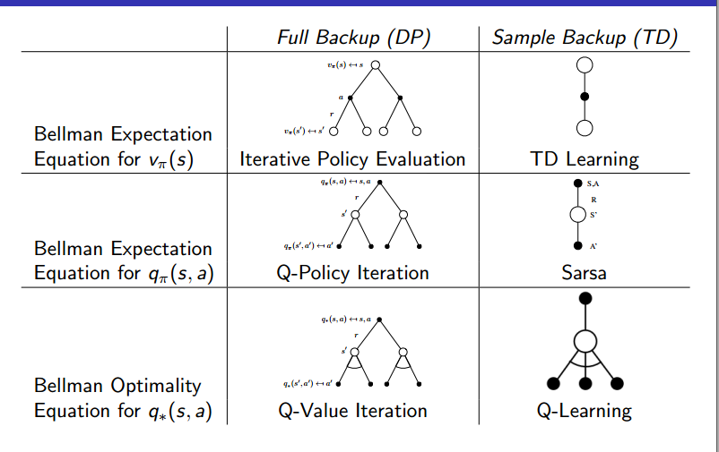

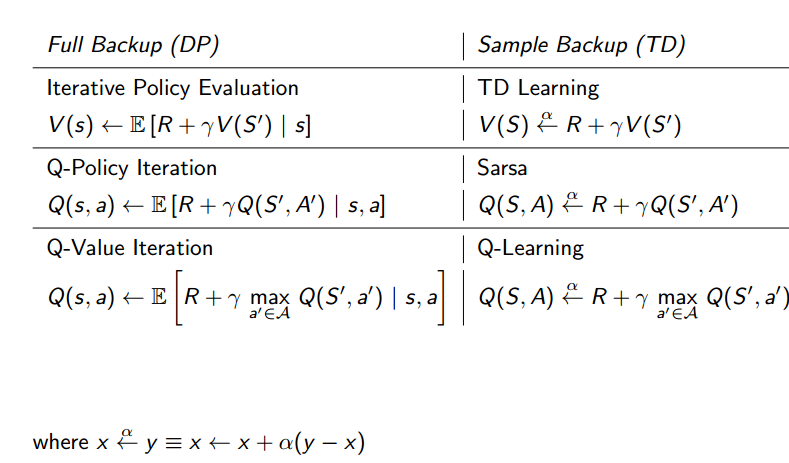

